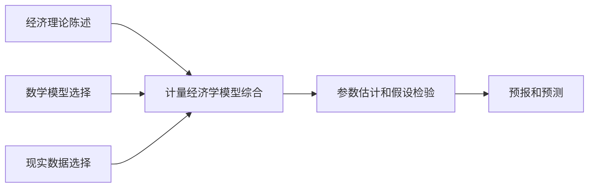

---
# 定义

计量经济学应将具象世界中的经济关系和抽象世界的数学模型进行联系：
- 前者是经济理论所负责的范畴，即宏微观经济学
- 后者是数学所负责的范畴，即数理统计学
从实际的学习看来，计量经济学更像是数理化的宏微观经济学或者应用化的数理统计学

# 方法论

因此，从定义分析上，我们的工作流程应该是： 

鉴于上图，我们可以发现我们需要学习的部分（提出的问题）可以具现为：
- 数学模型的选择到计量经济学模型的综合，理论的分析和实际的运用
- 从现实数据出发选择模型和从模型出发寻找数据
- 参数估计的假设检验——对数据结果的验证 

## 进一步——需要加深的问题

