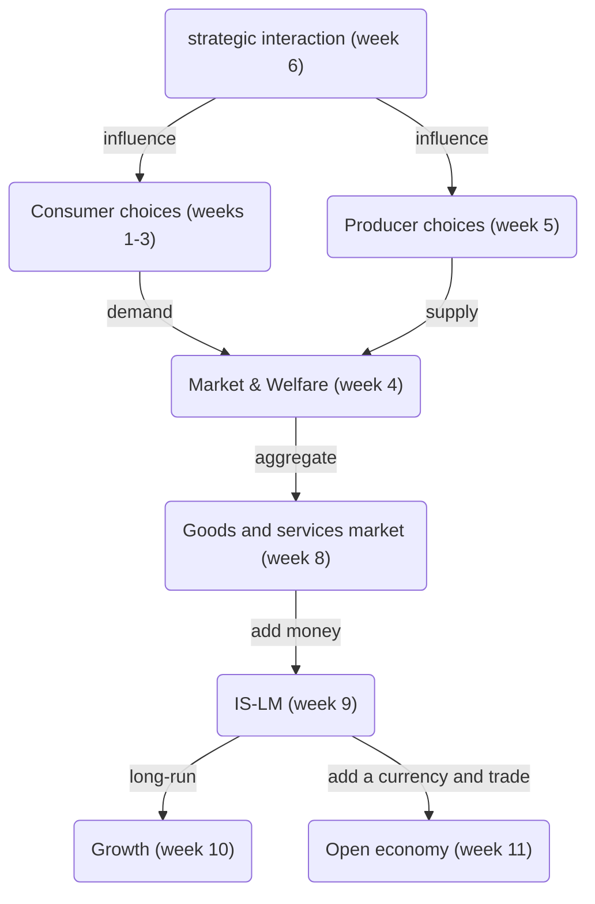
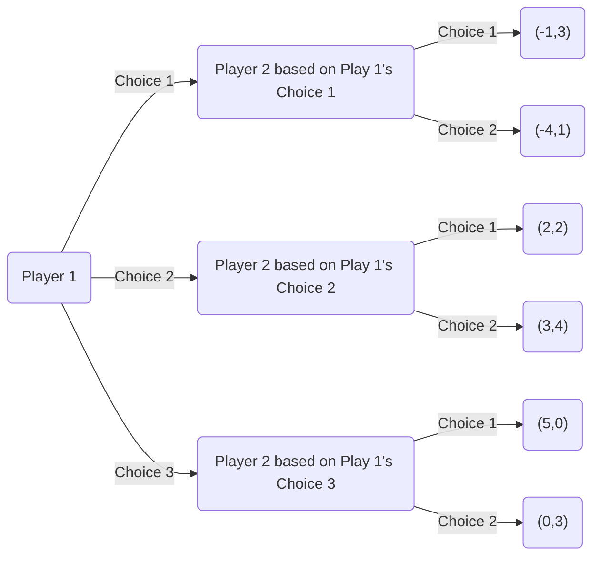
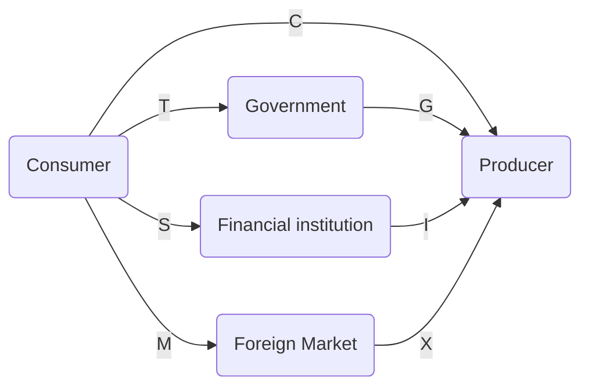

---
# Review Picture

# Strategic Interaction (Week 6)
## Game theory

### Simultaneous move games
the one cannot condition its choice on what others do
- order is not important
- No information exchange
- Rational

strategic form
#### Dominance and Iterated Dominance
就是按下图线判断大小然后轮流删留下均衡罢了:折纸加剪
Orange zone: Nash equilibrium
```tikz
\usetikzlibrary{decorations.pathreplacing}
\begin{document}
\begin{tikzpicture}[scale=2]

\fill[orange] (2,1) -- (2,2) -- (4,2) -- (4,1) -- cycle;

\draw[thick, -] (0,3) -- (4,3) -- (4,0) -- (0,0) -- (0,3);
\draw[thick, -] (2,0) -- (2,3); 
\draw[thick, -] (0,1) -- (4,1); 
\draw[thick, -] (0,2) -- (4,2); 
\node[blue] at (2,3.95) [align=center] {$Player\;2$};
\node[red] at (-1.5,1.5) [align=center] {$Player\;1$};

\node at (1,3.5) [align=center] {$Choice\;1$};
\node at (3,3.5) [align=center] {$Choice\;2$};

\node at (-0.5,0.5) [align=center] {$Choice\;1$};
\node at (-0.5,1.5) [align=center] {$Choice\;2$};
\node at (-0.5,2.5) [align=center] {$Choice\;3$};

\node[red] at (0.5,0.5) [align=center] {\fontsize{20}{12}\selectfont$-1$};
\node[blue] at (1.5,0.5) [align=center] {\fontsize{20}{12}\selectfont$3$};
\node[red] at (2.5,0.5) [align=center] {\fontsize{20}{12}\selectfont$-4$};
\node[blue] at (3.5,0.5) [align=center] {\fontsize{20}{12}\selectfont$\underline1$};

\node[red] at (0.5,1.5) [align=center] {\fontsize{20}{12}\selectfont$\underline2$};
\node[blue] at (1.5,1.5) [align=center] {\fontsize{20}{12}\selectfont$2$};
\node[red] at (2.5,1.5) [align=center] {\fontsize{20}{12}\selectfont$\underline3$};
\node[blue] at (3.5,1.5) [align=center] {\fontsize{20}{12}\selectfont$\underline4$};

\node[red] at (0.5,2.5) [align=center] {\fontsize{20}{12}\selectfont$5$};
\node[blue] at (1.5,2.5) [align=center] {\fontsize{20}{12}\selectfont$0$};
\node[red] at (2.5,2.5) [align=center] {\fontsize{20}{12}\selectfont$0$};
\node[blue] at (3.5,2.5) [align=center] {\fontsize{20}{12}\selectfont$\underline3$};

\draw[domain = 0.5:2.5, red] plot (\x,{0.5});
\draw[domain = 0.5:2.5, red] plot (\x,{1.5});
\draw[domain = 0.5:2.5, red] plot (\x,{2.5});

\draw[domain = 0.5:2.5, blue] plot ({1.5},\x);
\draw[domain = 0.5:2.5, blue] plot ({3.5},\x);
\end{tikzpicture}
\end{document}
```

反应函数图与古诺解，斯塔克伯格解开
### Sequential games
- Order is important
- Have information exchange
- Rational

backward induction
subgame perfect equilibrium


# Consumer Choices (Week 1-3)

## Budget constraint 
```tikz
\usetikzlibrary{decorations.pathreplacing}
\begin{document}

\begin{tikzpicture}[scale=2]
\draw[thick, ->] (-0.2,0) --(6,0) node[right] {$q_1$};
\draw[thick, ->] (0,-0.2) --(0,6) node[above] {$q_2$};

\fill[orange] (0,0) -- (0,4) -- (4,0) -- cycle;

\draw[domain = 0:4] plot (\x,{(-1*\x)+4}) node[right]at(0.5,4){$BC:p_1q_1+p_2q_2=m$} node[below]at(4,0){$\frac{m}{p_1}$} node[left]at(0,4){$\frac{m}{p_2}$};

% Points A, B, C 
\filldraw[blue] (1,1) circle (2pt) node[below left] {A}; \filldraw[green] (3,3) circle (2pt) node[below right] {C}; \filldraw[red] (2,2) circle (2pt) node[below right] {B}; % Fill budget area 

\end{tikzpicture}
\end{document}
```
## Preference & Utility
```tikz
\usetikzlibrary{decorations.pathreplacing}
\begin{document}
\begin{tikzpicture}[scale=2]
\draw[thick, ->] (-0.2,0) --(6,0) node[right] {$q_1$};
\draw[thick, ->] (0,-0.2) --(0,5) node[above] {$q_2$};

\draw (1,4) arc (180:270:3);
\draw (2,4) arc (180:270:2);
\draw (4-2^0.5,4) arc (180:270:2^0.5);

\draw[domain = 2:4, dashed ] plot (\x,{-1*\x+6});

\draw[domain = 4:6] plot (\x,{1}) node[right]{$IC_1$};
\draw[domain = 4:6] plot (\x,{2}) node[right]{$IC_2$};
\draw[domain = 4:6] plot (\x,{4-2^0.5}) node[right]{$IC_3$};

\fill (1.88,1.88) circle (2pt) node[below] {$q_a$};

\fill (2.59,2.59) circle (2pt) node[below] {$q_b$};

\fill (3,3) circle (2pt) node[below] {$q_c$};

\fill(4,2) circle (2pt) node[below] {$q_d$};

\fill(5,2) circle (2pt) node[below] {$q_e$};
\end{tikzpicture}
\end{document}
```
$$\begin{aligned} 
&Assumption_1 - Completeness: q_i \succeq q_j \; or \;  q_j \succeq q_i.\\
&Assumption_2 - Transitivity: q_c > q_b \; and \; q_b > q_a \Rightarrow q_c > q_a\\
&Assumption_3 - Monotonic:q_e > q_d \\
&Assumption_4 - Convex: q_c > q_d
\end{aligned}$$
```tikz
\usetikzlibrary{decorations.pathreplacing}
\begin{document}

\begin{tikzpicture}[scale=2]
\draw[thick, ->] (-0.2,0) --(6,0) node[right] {$q_1$};
\draw[thick, ->] (0,-0.2) --(0,6) node[above] {$q_2$};

\draw[domain = 1:3] plot (\x,{(\x)^(-1)*4+2});
\draw[domain = 1:3^(-1)*4+2] plot (3,\x) node at(2.75,2.5) [left]{$Have\;neutral$};
\draw[domain = 3:5] plot (\x, \x-2) node at(4.5,2) [right]{$Have\;bad$};


\draw[domain = 1.5:3.5] plot (\x,{(\x-0.5)^(-1)*4+2}) node at(2,5) [right]{$All\;good$}; 
\draw[domain = 2:(3.5-0.5)^(-1)*4+2] plot (3.5, \x); 
\draw[domain = 3.5:5] plot (\x, \x-2+0.5);

\draw[domain = 2.75:(25/6), dashed] plot (\x, {2*\x-5}); 
\draw[domain = 1:(25/6), dashed] plot (\x, {3^(-1)*4+2});

\end{tikzpicture}
\end{document}
```


$$\begin{aligned} 
&Diminishing\;marginal\;utility\;judgment\;(Increasing>0,Decreasing<0):\\
&\quad\quad\quad\quad\quad\quad\quad\quad\quad sgn(u''(q_i,q_j))=sgn(MU'_i)=sgn(\frac{\partial^2u(q_i,q_j)}{\partial q_i^2})\\
&Commodity\;attribute\;judgment\;(Good>0,Bad<0,Neutral=0):\\
&\quad\quad\quad\quad\quad\quad\quad\quad\quad sgn(u'(q_i,q_j))=sgn(MU_i)=sgn(\frac{\partial u(q_i,q_j)}{\partial q_i})\\
&Commodity\;relation\;judgment\;(Substitution>0,Complementary<0,Perfect\;Substitution=0):\\
&\quad\quad\quad\quad\quad\quad\quad\quad\quad sgn(MRS'_{ij})=sgn(\frac{\partial\frac{MU_i}{MU_j}}{\partial q_i})
\end{aligned}$$
- 边际效用是否为负，商品的属性（喜好品，厌恶品），商品的性质（普通品(含必需品，奢侈品)，劣等品（含吉芬品））商品的关系判断不存在关联
- 对于折线图中分段无差异线的看法
	1. 依照需求量的变化划分区域
	2. 在不同的区域内，重复基本的移动分析
	3. 由于无差异线的密布，点的移动本质上反映的是效用的变化！
## Choices 
### Optimization
Utility maximization
$$\begin{aligned} &\max_{q_1.q_2} u(q_1,q_2) \\
&s.t. p_1q_1+p_2q_2=m \\

\therefore\;\;&MRS_{12}=-\frac{MU_{1}}{MU_{2}}=-\frac{p_1}{p_2}
\end{aligned}$$
```tikz
\usetikzlibrary{decorations.pathreplacing}
\begin{document}

\begin{tikzpicture}[scale=2]
\draw[thick, ->] (-0.2,0) --(6,0) node[right] {$q_1$};
\draw[thick, ->] (0,-0.2) --(0,6) node[above] {$q_2$};

\draw[domain = 0:4] plot (\x,{(-1*\x)+4}) node[right]at(0.5,3){$BC:p_1q_1+p_2q_2=m$} node[below]at(4,0){$\frac{m}{p_1}$} node[left]at(0,4){$\frac{m}{p_2}$};

\draw[domain = 1:4, red, text=red] plot (\x,{(\x)^(-1)*4}) node[right]{$IC_{Equilibrium}:u(q_1,q_2)$};

\draw[domain = 1:4] plot (\x,{(\x)^(-1)*4-0.5}) node[right]{$IC_{Excess\,budget}:u(q_1,q_2)$};

\draw[domain = 1:4] plot (\x,{(\x)^(-1)*6.25}) node[right]{$IC_{Unenough\,budget}:u(q_1,q_2)$};

\fill[red] (2,2) circle (2pt) node[below] {$IC_{Equilibrium\,solution}$};

\draw[domain = 0:2, dashed] plot ({2},\x) node[below] at(2,0) {$q_1^*$};
\draw[domain = 0:2, dashed] plot (\x,{2}) node[left] at(0,2) {$q_2^*$};

\end{tikzpicture}
\end{document}
```
```tikz
\usetikzlibrary{decorations.pathreplacing}
\begin{document}

\begin{tikzpicture}[scale=2]
\draw[thick, ->] (-0.2,0) --(6,0) node[right] {$q_1$};
\draw[thick, ->] (0,-0.2) --(0,6) node[above] {$q_2$};

\draw[domain = 0:4] plot (\x,{(-1*\x)+4}) node[below right]{$BC_{|MRS| = |-\frac{p_1}{p_2}|}$};

\draw[domain = 0:4, blue] plot (\x,{(-4*\x)/9+8/3}) node[below right]{$BC_{|MRS| < |-\frac{p_1}{p_2}|}$};

\draw[domain = 1:4, red, text=red] plot (\x,{4/\x}) node[right]{$IC:u(q_1,q_2)$};

\fill[red] (2,2) circle (2pt) node[below] {$IC_{Equilibrium\,solution}$};

\fill[blue] (3,4/3) circle (2pt);

\draw[domain = 0:2, dashed] plot ({2},\x) node[below] at(2,0) {$q_1^*$};
\draw[domain = 0:2, dashed] plot (\x,{2}) node[left] at(0,2) {$q_2^*$};

\end{tikzpicture}
\end{document}
```
### Interior, corner, and kinky solutions
```tikz
\usetikzlibrary{decorations.pathreplacing}
\begin{document}

\begin{tikzpicture}[scale=2]
\draw[thick, ->] (-0.2,0) --(6,0) node[right] {$q_1$};
\draw[thick, ->] (0,-0.2) --(0,6) node[above] {$q_2$};

\draw[domain = 0:4] plot (\x,{(-1*\x)+4}) node[right]at(0.5,3){$BC:p_1q_1+p_2q_2=m$};

\draw[domain = 1:4, red, text=red] plot (\x,{(\x)^(-1)*4}) node[right]{$IC_{Equilibrium}:u(x,y)$};

\draw[domain = 0:2, blue, text=blue] plot (\x,{(\x)*(-2)+4}) node[above right]{$IC_{Perfect\,substitute}:u(x,y)=ax+by$};

\draw[domain = 2.25:6, green] plot ({2.25},\x);
\draw[domain = 2.25:6, green, text=green] plot (\x,{2.25})
node[right]{$IC_{Perfect\,complement}:u(x,y)=\min (ax,by)$};

\fill[red] (2,2) circle (2pt) node[below] {$IC_{Equilibrium\,solution}$};
\fill[green] (2.25,2.25) circle (2pt) node[above right] {$IC_{Kinky\,solution}$};
\fill[blue] (0,4) circle (2pt) node[above] {$IC_{Corner\,solution}$};

\draw[domain = 0:2, dashed] plot ({2},\x) node[below] at(2,0) {$q_1^*$};
\draw[domain = 0:2, dashed] plot (\x,{2}) node[left] at(0,2) {$q_2^*$};

\end{tikzpicture}
\end{document}
```
# Producer Choices (Week 5)
类比
$$\begin{aligned} &\max_{q_1.q_2} u(q_1,q_2) \\
&s.t. p_1q_1+p_2q_2=m
\\
\therefore\;\;&MRS_{12}=-\frac{MU_{1}}{MU_{2}}=-\frac{p_1}{p_2}
\end{aligned}$$
Profit maximization
$$\begin{aligned} &\max_{L.K} Q=f(L,K) \\
&s.t. \omega L+rK = C \\
\\
\therefore\;\;&MRTS_{LK}=-\frac{MP_{L}}{MP_{K}}=-\frac{\omega}{r}\\\\
USE:\;\;&\mathcal{Lagrange}(L,K,λ)=f(L,K)+λ(\omega L+rk-C)\\

\\\therefore\;\;&\Rightarrow F(C,\omega ,r,L,K)=0
\\&\Rightarrow F(\omega,L)=0(Labor\;price\;curve)
\\&\Rightarrow G(C,L,K)=0(Cost\;curve)
\end{aligned}
$$

Cost curve
$$\begin{aligned} 
&\because\;G(C,L,K)=0\;\;\;(Long-run)\\
&\;\;\;Q=f(L,\bar{K})\Rightarrow L=f^{-1}(Q,\bar{K})\;\;\;(Fix\;K)\\
&\therefore\;G(C,f^{-1}(Q,\bar{K})) = 0\;\;\;(Short-run)
\end{aligned}$$


```tikz
\usetikzlibrary{decorations.pathreplacing}
\begin{document}

\begin{tikzpicture}[scale=4]
\draw[thick, ->] (-0.2,0) --(3,0) node[right] {$Q$};
\draw[thick, ->] (0,-0.2) --(0,3) node[above] {$C$};

\draw[domain=0:2.5] plot (\x,{1}) node[right] {$TFC$};
\draw[domain=0:2.5] plot (\x,{0.9*\x-0.65*\x*\x+0.2*\x*\x*\x}) node[right] {$TVC(Q)$};
\draw[domain=0:2.5] plot (\x,{1+(0.9*\x)-0.65*\x*\x+0.2*\x*\x*\x}) node[right] {$TC(Q)$};

\end{tikzpicture}
\end{document}
```

```tikz
\usetikzlibrary{decorations.pathreplacing}
\begin{document}

\begin{tikzpicture}[scale=4]
\draw[thick, ->] (-0.2,0) --(3,0) node[right] {$Q$};
\draw[thick, ->] (0,-0.2) --(0,3) node[above] {$C$};

\draw[domain=0.5:2.5] plot (\x,{0.9-(1.3*\x)+(0.6*\x*\x)}) node[right] {$MC(Q)$};
\draw[domain=0.5:2.5] plot (\x,{0.9-(0.65*\x)+0.2*\x*\x+1/\x}) node[right] {$AC(Q)$};
\draw[domain=0.5:2.5] plot (\x,{0.9-(0.65*\x)+0.2*\x*\x}) node[right] {$AVC(Q)$};
\draw[domain=0.5:2.5] plot (\x,{1/\x}) node[right]
{$AFC(Q)$};
\fill (2.16,0.892) circle (0.8pt) node[above] {$A_{min}$};

\end{tikzpicture}
\end{document}
```

Production function)
$$\begin{aligned} 
&\because\;G(C,L,K)=0\;\;\;(Long-run)\\
&\;\;\;C=\omega L+r\bar{K}\Rightarrow C=f^{-1}(Q,\bar{K})\;\;\;(Fix\;K)\\
&\therefore\;G(f^{-1}(Q,\bar{K}),L) = 0\;\;\;(Short-run)
\end{aligned}$$

```tikz
\usetikzlibrary{decorations.pathreplacing}
\usetikzlibrary{arrows.meta}
\begin{document}
\begin{tikzpicture}[scale=2]
\fill[gray!20] (0.5,0.5) -- (1.5,0.5) -- (0.5,1.5) -- cycle;
\fill[gray!20] (0.75,1.25) -- (1.75,1.25) -- (0.75,2.25) -- cycle;
\fill[gray!20] (1,2) -- (2,2) -- (1,3) -- cycle;
\fill[gray!20] (1.75,2.25) -- (1.75,3.25) -- (2.75,2.25) -- cycle;
\fill[gray!20] (2,3) -- (2,4) -- (3,3) -- cycle;
\fill[gray!20] (2.75,3.25) -- (2.75,4.25) -- (3.75,3.25) -- cycle;

\draw[thick, ->] (-0.2,0) --(7,0) node[right] {$L$};
\draw[thick, ->] (0,-0.2) --(0,7) node[above] {$K$};


\draw[domain = 0:1] plot (\x,{(-1*\x)+1})
node[left] at(0,1) {$\frac{C_1^*}{r}$}
node[below] at(1,0) {$\frac{C_1^*}{\omega}$};

\draw[domain = 0:2] plot (\x,{(-1*\x)+2})
node[left] at(0,2) {$\frac{C_2^*}{r}$}
node[below] at(2,0) {$\frac{C_2^*}{\omega}$};

\draw[domain = 0:3] plot (\x,{(-1*\x)+3}) 
node[left] at(0,3) {$\frac{C_3^*}{r}$}
node[below] at(3,0) {$\frac{C_3^*}{\omega}$};

\draw[domain = 0:4] plot (\x,{(-1*\x)+4}) 
node[left] at(0,4) {$\frac{C_4^*}{r}$}
node[below] at(4,0) {$\frac{C_4^*}{\omega}$};

\draw[domain = 0:5] plot (\x,{(-1*\x)+5}) 
node[left] at(0,5) {$\frac{C_5^*}{r}$}
node[below] at(5,0) {$\frac{C_5^*}{\omega}$};

\draw[domain = 0:6] plot (\x,{(-1*\x)+6}) 
node[left] at(0,6) {$\frac{C_6^*}{r}$}
node[below] at(6,0) {$\frac{C_6^*}{\omega}$};

\fill (0.5,0.5) circle (2pt) node[above] {A};
\fill (0.75,1.25) circle (2pt) node[above] {B};
\fill (1,2) circle (2pt) node[above] {C};
\fill (1.75,2.25) circle (2pt) node[above] {D};
\fill (2,3) circle (2pt) node[above] {E};
\fill (2.75,3.25) circle (2pt) node[above] {F};
\fill (3,4) circle (2pt) node[above] {G};

\draw[smooth] plot coordinates {(0.5,0.5) (0.75,1.25) (1,2) (1.75,2.25) (2,3) (2.75,3.25) (3,4)};
\end{tikzpicture}
\end{document}
```
```tikz
\usetikzlibrary{decorations.pathreplacing}
\begin{document}

\begin{tikzpicture}[scale=4]
\draw[thick, ->] (-0.2,0) --(3,0) node[right] {$L$};
\draw[thick, ->] (0,-0.2) --(0,3) node[above] {$Q$};

\draw[domain=0:2.5] plot (\x,{(0.7*\x)+1.8*\x*\x-0.8*\x*\x*\x}) node[right] {$TP_L$};

\draw[domain=0.1:2.5] plot (\x,{0.7+1.8*\x-0.8*\x*\x}) node[right] {$AP_L$};

\draw[domain=0.1:1.8] plot (\x,{0.7+3.6*\x-2.4*\x*\x}) node[right] {$MP_L$};


\end{tikzpicture}
\end{document}

```
# Market & Welfare (Week 4)
## Demand
### Income effect analysis
#### Cross analysis method
```tikz
\usetikzlibrary{decorations.pathreplacing}
\usetikzlibrary{arrows.meta}
\begin{document}

\begin{tikzpicture}[scale=2]

\fill[gray!20] (1.5,1.5) -- (4,1.5) -- (4,4) -- (1.5,4) -- cycle;
\fill[gray!20] (1.5,1.5) -- (-1,1.5) -- (-1,-1) -- (1.5,-1) -- cycle;
\draw[thick, ->] (-0.2,0) --(6,0) node[right] {$q_1$};
\draw[thick, ->] (0,-0.2) --(0,6) node[above] {$q_2$};


\draw[domain = 0:3] plot (\x,{(-1*\x)+3}) ;

\draw[domain = 0.5:4, red] plot (\x,{(1.5^2)/\x}) node[right]{$$};
\draw[domain = 1:4, blue] plot (\x,{(2.5^2)/\x}) node[right]{$$};
\draw[domain= 0.1:2, blue] plot (\x, {(2.5^2/(\x + 1.5)) + 1.5}); 

\draw[domain= 3:6, blue] plot (\x, {(2.5^2/(\x - 1.5)) - 1.5}); 


\draw[domain = 0:5] plot (\x,{(-1*\x)+5}) node[below right]{$$};
\draw[domain = 0:5] plot (\x,{(-1*\x)+5}) node[below right]{$$};

\fill[red] (1.5,1.5) circle (1.5pt);
\fill (1,4) circle (1.5pt);
\fill (2.5,2.5) circle (1.5pt);
\fill (4,1) circle (1.5pt);

\draw[=>,thick, dashed, -{Latex[length=3mm,width=3mm]}] (1.5,1.5) -- (1,4);
\draw[=>,thick, dashed, -{Latex[length=3mm,width=3mm]}] (1.5,1.5) -- (2.5,2.5);
\draw[=>,thick, dashed, -{Latex[length=3mm,width=3mm]}] (1.5,1.5) -- (4,1);

\fill (3,3) circle (1.5pt) node[right] {A Zone};
\fill (3,0.5) circle (1.5pt) node[right] {B Zone};
\fill (0.05,0.5) circle (1.5pt) node[right] {D Zone};
\fill (0.05,3) circle (1.5pt) node[right] {C Zone};

\draw[domain = -1:6, dashed] plot ({1.5},\x) node[below] at(3,0) {$\frac{m_1^*}{p_1}$} node[below] at(5,0) {$\frac{m_2^*}{p_1}$};

\draw[domain = -1:6, dashed] plot (\x,{1.5}) node[left] at(0,3) {$\frac{m_1^*}{p_2}$} node[left] at(0,5) {$\frac{m_2^*}{p_2}$};

\end{tikzpicture}
\end{document}
```
- A -- $q_1$ and $q_2$ are the areas where the income effect of normal products falls
- B -- When $q_2$ is the inferior product and $q_1$ is the normal product, the income effect falls in the region
- C -- When $q_1$ is the inferior product and $q_2$ is the normal product, the income effect falls in the region
- D -- (Does not exist) two areas where the income effect of inferior goods falls
	- Prove：$$\begin{aligned}\because  \frac{\partial(p_iq_i+p_jq_j=m)}{\partial m}&=p_i\frac{\partial q_i}{\partial m}+p_j\frac{\partial q_j}{\partial m}=1\\ BUT:\;\;\frac{\partial q_{inferior}}{\partial m} &< 0 \; and \;p_i,p_j > 0   \end{aligned}$$

Always maintain the income curve of the demand for two normal good:
```tikz
\usetikzlibrary{decorations.pathreplacing}
\usetikzlibrary{arrows.meta}
\begin{document}
\begin{tikzpicture}[scale=2]
\fill[gray!20] (0.5,0.5) -- (1.5,0.5) -- (0.5,1.5) -- cycle;
\fill[gray!20] (0.75,1.25) -- (1.75,1.25) -- (0.75,2.25) -- cycle;
\fill[gray!20] (1,2) -- (2,2) -- (1,3) -- cycle;
\fill[gray!20] (1.75,2.25) -- (1.75,3.25) -- (2.75,2.25) -- cycle;
\fill[gray!20] (2,3) -- (2,4) -- (3,3) -- cycle;
\fill[gray!20] (2.75,3.25) -- (2.75,4.25) -- (3.75,3.25) -- cycle;
\draw[thick, ->] (-0.2,0) --(7,0) node[right] {$q_1$};
\draw[thick, ->] (0,-0.2) --(0,7) node[above] {$q_2$};


\draw[domain = 0:1] plot (\x,{(-1*\x)+1})
node[left] at(0,1) {$\frac{m_1^*}{p_2}$}
node[below] at(1,0) {$\frac{m_1^*}{p_1}$};

\draw[domain = 0:2] plot (\x,{(-1*\x)+2})
node[left] at(0,2) {$\frac{m_2^*}{p_2}$}
node[below] at(2,0) {$\frac{m_2^*}{p_1}$};

\draw[domain = 0:3] plot (\x,{(-1*\x)+3}) node[left] at(0,3) {$\frac{m_3^*}{p_2}$} node[below] at(3,0) {$\frac{m_3^*}{p_1}$}; 

\draw[domain = 0:4] plot (\x,{(-1*\x)+4}) node[left] at(0,4) {$\frac{m_4^*}{p_2}$} node[below] at(4,0) {$\frac{m_4^*}{p_1}$}; 

\draw[domain = 0:5] plot (\x,{(-1*\x)+5}) node[left] at(0,5) {$\frac{m_5^*}{p_2}$} node[below] at(5,0) {$\frac{m_5^*}{p_1}$}; 

\draw[domain = 0:6] plot (\x,{(-1*\x)+6}) node[left] at(0,6) {$\frac{m_6^*}{p_2}$} node[below] at(6,0) {$\frac{m_6^*}{p_1}$}; 

\fill (0.5,0.5) circle (2pt) node[above] {A};
\fill (0.75,1.25) circle (2pt) node[above] {B};
\fill (1,2) circle (2pt) node[above] {C};
\fill (1.75,2.25) circle (2pt) node[above] {D};
\fill (2,3) circle (2pt) node[above] {E};
\fill (2.75,3.25) circle (2pt) node[above] {F};
\fill (3,4) circle (2pt) node[above] {G};

\draw[smooth] plot coordinates {(0.5,0.5) (0.75,1.25) (1,2) (1.75,2.25) (2,3) (2.75,3.25) (3,4)};
\end{tikzpicture}
\end{document}
```
消参：
$$\begin{aligned} \because\;\;&\max_{q_i.q_j} u(q_i,q_j) \\
&s.t. p_iq_j+p_iq_j=m \\\\
USE:\;\;&\mathcal{Lagrange}(q_i,q_j,λ)=u(q_i,q_j)+λ(m−p_iq_i−p_jq_j)\\
\\\therefore\;\;&\Rightarrow F(m,p_i,q_i,p_j,q_j)=0
\\&\Rightarrow F(p_i,q_i)=0(The\;Demand\;curve\;of\;i)\\&\Rightarrow G(m,p_i,q_i)=0(The\;Engel\;curve\;of\;i)
\end{aligned}$$

### Total effect analysis
```tikz
\usetikzlibrary{decorations.pathreplacing, arrows.meta, patterns}
\begin{document}
\begin{tikzpicture}[scale=2]

\fill[red!20] (1.5,1.5) -- (4,1.5) -- (4,4) -- (1.5,4) -- cycle;
\fill[red!20] (1.5,1.5) -- (-1,1.5) -- (-1,-1) -- (1.5,-1) -- cycle;

\fill[black!10] (1.5,1.5) -- (1.5,4) -- (-1,4) -- (-1,1.5) -- cycle;

\fill[blue!20] (0.9,2.498) -- (0.9, 4.998) -- (3.4, 4.998) -- (3.4, 2.498) -- cycle;
\fill[blue!20] (0.9,2.498) -- (-1.6, 2.498) -- (-1.6, -0.002) -- (0.9, -0.002) -- cycle;

\fill[Magenta!20] (1.5, 2.498) -- (3.4, 2.498) -- (3.4, 4) -- (1.5, 4) -- cycle;
\fill[Magenta!20] (-1, -0.002) -- (0.9, -0.002) -- (0.9, 1.5) -- (-1, 1.5) -- cycle;


\draw[thick, ->] (-0.2,0) --(6,0) node[right] {$q_1$};
\draw[thick, ->] (0,-0.2) --(0,6) node[above] {$q_2$};


\draw[domain = 0:3] plot (\x,{(-1*\x)+3}) ;

\draw[domain = 0.5:4, red] plot (\x,{(1.5^2)/\x}) node[right]{$$};

\draw[domain= 3:6, blue] plot (\x, {(2.5^2/(\x - 1.5)) - 1.5}); 

\draw[domain= 0:1.7985] plot (\x, {-2.78*\x+5}); 


\draw[domain = 0:5] plot (\x,{(-1*\x)+5}) node[below right]{$$};
\draw[domain = 0:5] plot (\x,{(-1*\x)+5}) node[below right]{$$};

\fill (1.5,1.5) circle (1.5pt)node[below]{B};
\fill (4,1) circle (1.5pt)node[below]{C};
\fill (0.9,2.498) circle (1.5pt)node[below]{A};

\draw[=>,thick, dashed, -{Latex[length=3mm,width=3mm]}] (1.5,1.5) -- (4,1);
\draw[=>,thick, dashed, -{Latex[length=3mm,width=3mm]}] (0.9,2.498) -- (1.5,1.5);
\draw[=>,thick, dashed, -{Latex[length=3mm,width=3mm]}] (0.9,2.498) -- (4,1) ;

\draw[domain = -0.002:4.998, dashed] plot ({0.9},\x);
\draw[domain = -1.6:3.4, dashed] plot (\x,{2.498});


\draw[domain = -1:4, dashed] plot ({1.5},\x) node[below] at(3,0) {$\frac{m_1^*}{p_1}$} node[below] at(5,0) {$\frac{m_2^*}{p_1}$};

\draw[domain = -1:4, dashed] plot (\x,{1.5}) node[left] at(0,3) {$\frac{m_1^*}{p_2}$} node[left] at(0,5) {$\frac{m_2^*}{p_2}$};

\end{tikzpicture}
\end{document}
```

B point zone: Income effect (Focus on the size of the effect direction)
- red zone: one of two goods is inferior goods, and other zones are two normal goods
	- If the red zone is below the blue zone, $q_2$is inferior, and vice versa it is $q_1$above
- gray zone: WILL NOT FALL INTO!!!!
A point zrea: Total effect (Focus on absolute values)
- blue zone: complements, and other zones are substitutes

从图像看来有两种：
1. 固定被消参数 - 需求价格曲线
2. 对被消参数步长相等地变动并描点 - 需求收入曲线 
$$\begin{aligned}
df_{自由量—被求}=n_{总数}-n_{独立—固定参数}
\end{aligned}$$
对于$n_{总数}=5，n_{独立-固定参数}=3$使用旋转（定点2端点1）-- 需求曲线
对于$n_{总数}=5，n_{独立-固定参数}=2$使用平移（两端点各1）-- 收入曲线 多定一个参为短期成本线

且对于平移图像，若再固定一个参数，也可以达到使用旋转的效果，图像表现为对于特定的y点反求x值或反之。

## Market equilibrium
```tikz
\usetikzlibrary{decorations.pathreplacing}
\begin{document}

\begin{tikzpicture}[scale=2]
\draw[->] (2.8,0.2) -- (4.8,0.2) node[fill=white,midway]{$Shifts$};

\draw[|<->|] (1.5,1.5) -- (3.5,1.5) node[fill=white,midway] {$Excess\;demand$};
\draw[|<->|] (1.5,3.5) -- (3.5,3.5) node[fill=white,midway] {$Excess\;supply$};

\draw[thick, ->] (0,-0.2) --(0,6) node[above] {$Price$};
\draw[thick, ->] (-0.2,0) --(6,0) node[right] {$Quantity$};

\draw[domain = 0.1:2.9] plot (\x,{(-1*\x)+3}) node[above right]at(0,3){$D_1$};
\draw[domain = 0.1:4.9] plot (\x,{(-1*\x)+5}) node[above right]at(0,5){$D_2$};
\draw[domain = 0.1:4.9] plot (\x,{\x}) node[above left]at(5,5){$S$};

\fill (1.5,1.5) circle (1.5pt)node[left]{A};
\fill (2.5,2.5) circle (1.5pt)node[left]{B};

\draw[|<->|] (2.9,2.3) -- (4.9,0.3) node[midway, fill=white, sloped, above] {$Along\;the\;curve$};

\draw[domain = 0:1.5, dashed] plot (\x,{1.5}) node[left] at(0,1.5) {$P_e$};
\draw[domain = 0:2.5, dashed] plot (\x,{2.5}) node[left] at(0,2.5) {$P^*_e$};


\draw[domain = 0:1.5, dashed] plot ({1.5},\x) node[below] at(1.5,0) {$Q_e$};
\draw[domain = 0:2.5, dashed] plot ({2.5},\x) node[below] at(2.5,0) {$Q^*_e$};


\end{tikzpicture}
\end{document}
```
- Along the curve: Since the quantity changes with the price of the commodity.
- Change: Changes in determinants other than price.
## Elasticity 

弹性法：（对应的取弹性内部的那个导数判断为导数法）
商品的性质$(sgn(0))$
Price Elasticity of Demand, PED:
$$\begin{aligned} e_{D} = \frac{\% \Delta Q}{\% \Delta P} &= \frac{dQ}{dP} \cdot \frac{P}{Q} \\
\frac{dQ}{dP} &= \frac{1}{G'_{q_j}}
\end{aligned} $$
商品的关系$(sgn(0))$
Cross Elasticity of Demand, CED:
$$\begin{aligned}  e_{xy} = \frac{\% \Delta Q_x}{\% \Delta P_y} &= \frac{dQ_x}{dP_y} \cdot \frac{P_y}{Q_x} \\p.s. to:\;\;\;\;\;\;\;\;\;\;\;p_i&=K(q_i,p_j,q_j,m)\\\frac{dQ_x}{dP_y}&=K'_{q_j}\end{aligned} $$
收入影响$(sgn(0,1))$
Income Elasticity of Demand, IED:
$$\begin{aligned} e_{m} = \frac{\% \Delta Q}{\% \Delta M} &= \frac{dQ}{dM} \cdot \frac{M}{Q} \\
\frac{dQ}{dM} &= H'_m\end{aligned}$$
产出$(sgn(0))$
Price Elasticity of Supply, PES:
$$\begin{aligned} e_{S} = \frac{\% \Delta Q_s}{\% \Delta P} &= \frac{dQ_s}{dP} \cdot \frac{P}{Q_s}\\
\frac{dQ_s}{dP}&=\frac{1}{G'_{s-q_j}}\end{aligned}$$ 
- Inelastic: $0 < |E| < 1$ 
- Unit elastic: $|E| = 1$
- Elastic: $|E| > 1$ 
- Perfectly elastic: $|E| = \infty$
- Perfectly inelastic: $|E| = 0$
## Welfare and DWL 
### No Intervented market（需要补充）
- 需求量决定,
	- 需求满足下存在唯一需求
	- 需求不满足下存在两点需求 ==> 产生缺口（需求或生产缺口对应进口或出口）
- 对于图三，不会增加无谓损失因为多余需求不是损失
- “价格线上下”实际是“价格线上下+需求线左边！”
- 分开每次看，即每移动一次线都对新线判断再记面积变化
```tikz
\usetikzlibrary{decorations.pathreplacing}
\usetikzlibrary{arrows.meta}
\begin{document}

\begin{tikzpicture}[scale=2]
\fill[red!20] (0,1.5) -- (1.5,1.5) -- (0,0)-- cycle;
\fill[blue!20] (0,1.5) -- (0,5) --(1.5,3.5) -- (1.5,1.5) -- cycle;
\fill[black!20] (1.5,1.5)  -- (2.5,2.5) -- (1.5,3.5)-- cycle;

\draw[thick, ->] (0,-0.2) --(0,6) node[above] {$Price$};
\draw[thick, ->] (-0.2,0) --(6,0) node[right] {$Quantity$};


\draw[domain = 0.1:4.9] plot (\x,{(-1*\x)+5}) node[above right]at(0,5){$D_1$};
\draw[domain = 0.1:5] plot (\x,{\x}) node[above]at(5,5){$S$};

\draw[domain = 1:2] plot (\x,{(-1*\x)+3}) node[above right]at(1,2){$D_2$};

\fill (1.5,1.5) circle (1.5pt)node[right]{A};
\fill (2.5,2.5) circle (1.5pt)node[above]{B};
\fill (1.5,3.5) circle (1.5pt)node[right]{C};
\fill (0,1.5) circle (1.5pt)node[left]{E};


\draw[thick,->, dotted] (1.5,1.5) -- (1.5,3.45); 
\draw[thick,->, dotted] (1.5,1.5) -- (0.05,1.5); 

\end{tikzpicture}
\end{document}
```


```tikz
\usetikzlibrary{decorations.pathreplacing}
\usetikzlibrary{arrows.meta}
\begin{document}
\begin{tikzpicture}[scale=2]
\fill[red!20] (1.5,1.5) -- (1.5,3.5) -- (0,3.5) -- (0,0)-- cycle;
\fill[blue!20] (1.5,3.5) -- (0,3.5) -- (0,5) -- cycle;
\fill[black!20] (1.5,1.5)  -- (2.5,2.5) -- (1.5,3.5)-- cycle;
\fill[black!20] (1.5,1.5)  -- (2.5,2.5) -- (1.5,3.5)-- cycle;

\draw[thick, ->] (0,-0.2) --(0,6) node[above] {$Price$};
\draw[thick, ->] (-0.2,0) --(6,0) node[right] {$Quantity$};


\draw[domain = 0.1:4.9] plot (\x,{(-1*\x)+5}) node[above right]at(0,5){$D_1$};
\draw[domain = 0.1:5] plot (\x,{\x}) node[above]at(5,5){$S$};
\draw[domain = 1:2] plot (\x,{\x+2}) node[above]at(2,4){$S_2$};

\fill (1.5,1.5) circle (1.5pt)node[right]{C};
\fill (2.5,2.5) circle (1.5pt)node[above]{B};
\fill (1.5,3.5) circle (1.5pt)node[right]{A};
\fill (0,3.5) circle (1.5pt)node[left]{E};


\draw[thick,->, dotted] (1.5,3.5) -- (1.5,1.55); 
\draw[thick,->, dotted] (1.5,3.5) -- (0.05,3.5); 


\end{tikzpicture}
\end{document}
```


```tikz
\usetikzlibrary{decorations.pathreplacing}
\usetikzlibrary{arrows.meta}
\begin{document}
\begin{tikzpicture}[scale=2]
\fill[red!20] (1.5,1.5) -- (1.5,3.5) -- (0,3.5) -- (0,0)-- cycle;
\fill[blue!20] (1.5,3.5) -- (0,3.5) -- (0,5) -- cycle;
\fill[black!20] (1.5,1.5)  -- (2.5,2.5) -- (1.5,3.5)-- cycle;


\draw[thick, ->] (0,-0.2) --(0,6) node[above] {$Price$};
\draw[thick, ->] (-0.2,0) --(6,0) node[right] {$Quantity$};

\draw[domain = 3:4] plot (\x,{(-1*\x)+7}) node[above right]at(3,4){$D_2$};
\draw[domain = 0.1:4.9] plot (\x,{(-1*\x)+5}) node[above right]at(0,5){$D_1$};
\draw[domain = 0.1:5] plot (\x,{\x}) node[above]at(5,5){$S$};

\fill (3.5,3.5) circle (1.5pt)node[left]{A};
\fill (2.5,2.5) circle (1.5pt)node[above]{B};
\fill (1.5,3.5) circle (1.5pt)node[right]{C};
\fill (0,3.5) circle (1.5pt)node[left]{E};
\fill (1.5,0) circle (1.5pt)node[below]{F};
\fill (3.5,0) circle (1.5pt)node[below]{G};
\draw[thick,->, dotted] (3.5,3.5) -- (0.05,3.5); 
\draw[thick,->, dotted] (3.5,3.5) -- (3.5,0.05); 
\draw[thick,->, dotted] (1.5,3.5) -- (1.5,0.05); 
\end{tikzpicture}
\end{document}
```

```tikz

```
```tikz
\usetikzlibrary{decorations.pathreplacing}
\usetikzlibrary{arrows.meta}
\begin{document}
\begin{tikzpicture}[scale=2]
\fill[red!20] (0,1.5) -- (1.5,1.5) -- (0,0)-- cycle;
\fill[blue!20] (0,1.5) -- (0,5) --(1.5,3.5) -- (1.5,1.5) -- cycle;
\fill[black!20] (1.5,1.5) -- (1.5,3.5)-- (3.5,1.5) -- cycle;
\draw[thick, ->] (0,-0.2) --(0,6) node[above] {$Price$};
\draw[thick, ->] (-0.2,0) --(6,0) node[right] {$Quantity$};

\draw[domain = 3:4] plot (\x,{\x-2}) node[above right]at(4,2){$S_2$};
\draw[domain = 0.1:4.9] plot (\x,{(-1*\x)+5}) node[above right]at(0,5){$D_1$};
\draw[domain = 0.1:5] plot (\x,{\x}) node[above]at(5,5){$S$};

\fill (3.5,1.5) circle (1.5pt)node[left]{A};

\fill (2.5,2.5) circle (1.5pt)node[above]{B};
\fill (1.5,1.5) circle (1.5pt)node[right]{C};
\fill (0,1.5) circle (1.5pt)node[left]{E};
\fill (1.5,0) circle (1.5pt)node[below]{F};
\fill (3.5,0) circle (1.5pt)node[below]{G};
\draw[thick,->, dotted] (3.5,1.5) -- (0.05,1.5); 
\draw[thick,->, dotted] (3.5,1.5) -- (3.5,0.05); 
\draw[thick,->, dotted] (1.5,1.5) -- (1.5,0.05); 
\end{tikzpicture}
\end{document}
```


### Government intervented market
- Fixed price
	- shift
	- Limited price
		- Ceiling price
```tikz
\usetikzlibrary{decorations.pathreplacing}
\usetikzlibrary{arrows.meta}
\begin{document}

\begin{tikzpicture}[scale=2]
\fill[red!20] (0,1.5) -- (1.5,1.5) -- (0,0)-- cycle;
\fill[blue!20] (0,1.5) -- (0,5) --(1.5,3.5) -- (1.5,1.5) -- cycle;
\fill[black!20] (1.5,1.5)  -- (2.5,2.5) -- (1.5,3.5)-- cycle;

\draw[thick, ->] (0,-0.2) --(0,6) node[above] {$Price$};
\draw[thick, ->] (-0.2,0) --(6,0) node[right] {$Quantity$};

\draw[domain = 0.1:4.9] plot (\x,{(-1*\x)+5}) node[above right]at(0,5){$D_1$};
\draw[domain = 0.1:5] plot (\x,{\x}) node[above]at(5,5){$S$};


\fill (1.5,1.5) circle (1.5pt)node[right]{A};
\fill (2.5,2.5) circle (1.5pt)node[above]{B};
\fill (1.5,3.5) circle (1.5pt)node[right]{C};
\fill (0,1.5) circle (1.5pt)node[left]{E};
\fill (3.5,1.5) circle (1.5pt)node[right]{F};

\draw[thick,->, dotted] (1.5,1.5) -- (1.5,3.45); 
\draw[thick,->, dotted] (0,1.5) -- (3.45,1.5); 

\end{tikzpicture}
\end{document}
```
		- Floor price
```tikz
\usetikzlibrary{decorations.pathreplacing}
\usetikzlibrary{arrows.meta}
\begin{document}
\begin{tikzpicture}[scale=2]
\fill[red!20] (1.5,1.5) -- (1.5,3.5) -- (0,3.5) -- (0,0)-- cycle;
\fill[blue!20] (1.5,3.5) -- (0,3.5) -- (0,5) -- cycle;
\fill[black!20] (1.5,1.5)  -- (2.5,2.5) -- (1.5,3.5)-- cycle;


\draw[thick, ->] (0,-0.2) --(0,6) node[above] {$Price$};
\draw[thick, ->] (-0.2,0) --(6,0) node[right] {$Quantity$};

\draw[domain = 0.1:4.9] plot (\x,{(-1*\x)+5}) node[above right]at(0,5){$D_1$};
\draw[domain = 0.1:5] plot (\x,{\x}) node[above]at(5,5){$S$};

\fill (3.5,3.5) circle (1.5pt)node[right]{A};
\fill (2.5,2.5) circle (1.5pt)node[above]{B};
\fill (1.5,3.5) circle (1.5pt)node[right]{C};
\fill (0,3.5) circle (1.5pt)node[left]{E};
\fill (1.5,1.5) circle (1.5pt)node[below]{F};
\draw[thick,->, dotted] (0,3.5) -- (3.45,3.5); 
\draw[thick,->, dotted] (1.5,3.5) -- (1.5,1.55); 
\end{tikzpicture}
\end{document}
``` 
- Fixed quantity
	- shift 
		- tax
```tikz
\usetikzlibrary{decorations.pathreplacing}
\usetikzlibrary{arrows.meta}
\begin{document}
\begin{tikzpicture}[scale=2]

\fill[red!20] (1.5,1.5) -- (0,1.5) -- (0,0) -- cycle;
\fill[blue!20] (1.5,3.5) -- (0,3.5) -- (0,5) -- cycle;
\fill[yellow!20] (0,1.5) -- (1.5,1.5) -- (1.5,3.5) -- (0,3.5)-- cycle;
\fill[black!20] (1.5,1.5)  -- (2.5,2.5) -- (1.5,3.5)-- cycle;


\draw[thick, ->] (0,-0.2) --(0,6) node[above] {$Price$};

\draw[thick, ->] (-0.2,0) --(6,0) node[right] {$Quantity$};

\draw[domain = 0.1:4.9] plot (\x,{(-1*\x)+5}) node[above right]at(0,5){$D_1$};
\draw[domain = 0.1:5] plot (\x,{\x}) node[above]at(5,5){$S$};
\draw[domain = 1:2] plot (\x,{(-1*\x)+3}) node[above right]at(1,2){$D_2$};
\fill (1.5,1.5) circle (1.5pt)node[right]{A};
\fill (2.5,2.5) circle (1.5pt)node[above]{B};
\fill (1.5,3.5) circle (1.5pt)node[right]{C};
\fill (0,3.5) circle (1.5pt)node[left]{E};
\fill (0,1.5) circle (1.5pt)node[left]{F};
\draw[thick,->, dotted] (1.5,1.5) -- (1.5,3.45); 
\draw[thick,->, dotted] (1.5,3.5) -- (0.05,3.5); 
\draw[thick,->, dotted] (1.5,1.5) -- (0.05,1.5);

\end{tikzpicture}
\end{document}
```
```tikz
```
```tikz
\usetikzlibrary{decorations.pathreplacing}
\usetikzlibrary{arrows.meta}
\begin{document}

\begin{tikzpicture}[scale=2]
\fill[red!20] (1.5,1.5) -- (0,1.5) -- (0,0) -- cycle;
\fill[blue!20] (1.5,3.5) -- (0,3.5) -- (0,5) -- cycle;
\fill[yellow!20] (0,1.5) -- (1.5,1.5) -- (1.5,3.5) -- (0,3.5)-- cycle;
\fill[black!20] (1.5,1.5)  -- (2.5,2.5) -- (1.5,3.5)-- cycle;

\draw[thick, ->] (0,-0.2) --(0,6) node[above] {$Price$};
\draw[thick, ->] (-0.2,0) --(6,0) node[right] {$Quantity$};


\draw[domain = 0.1:4.9] plot (\x,{(-1*\x)+5}) node[above right]at(0,5){$D_1$};
\draw[domain = 0.1:5] plot (\x,{\x}) node[above]at(5,5){$S$};

\draw[domain = 1:2] plot (\x,{(-1*\x)+3}) node[above right]at(1,2){$D_2$};

\fill (1.5,1.5) circle (1.5pt)node[right]{A};
\fill (2.5,2.5) circle (1.5pt)node[above]{B};
\fill (1.5,3.5) circle (1.5pt)node[right]{C};
\fill (0,3.5) circle (1.5pt)node[left]{E};
\fill (0,1.5) circle (1.5pt)node[left]{D};


\draw[thick,->, dotted] (1.5,1.5) -- (1.5,3.45); 
\draw[thick,->, dotted] (1.5,3.5) -- (0.05,3.5); 
\draw[thick,->, dotted] (1.5,1.5) -- (0.05,1.5); 

\end{tikzpicture}
\end{document}
```
		- quota


## Perfect competition market
## Monopoly market 
```tikz
\usetikzlibrary{decorations.pathreplacing}
\begin{document}
\begin{tikzpicture}[scale=4]
\fill[red!20] (2.56,1.5) -- (2.56,0.94) -- (0,0.94) -- (0,1.5) -- cycle;
\fill[blue!10] (1.58,1.01) -- (0,1.01) -- (0,1.92) -- (1.58,1.92) -- cycle;

\draw[thick, ->] (-0.2,0) --(4,0) node[right] {$Q$};
\draw[thick, ->] (0,-0.2) --(0,4) node[above] {$C$};

\draw[domain=0.5:3] plot (\x,{0.9-(1.3*\x)+(0.6*\x*\x)}) node[right] {$MC(Q)$};

\draw[domain=0.5:4] plot (\x,{0.9-(0.65*\x)+0.2*\x*\x+1/\x}) node[right] {$AC(Q)$};

\draw[domain=0:3] plot (\x,{1.5}) node[right] {$P=MR$};
\draw[domain=0:3] plot (\x,{3.5-\x}) node[right] {$P(Q)$};
\draw[domain=0:1.7] plot (\x,{3.5-2*\x}) node[right] {$MR(Q)$};


\fill (2.16,0.892) circle (0.8pt) node[above] {$A_{min}$};
\fill (1.58,0.34) circle (0.8pt) node[above] {$Q_{monopoly\;market}$};

\draw[thick, -, dashed] (1.58,0.34) -- (1.58,1.92);
\draw[thick, ->, dashed] (1.58,1.01) -- (0.01,1.01);
\draw[thick, ->, dashed] (1.58,1.92) -- (0.01,1.92);


\fill (1.58,1.92) circle (0.8pt);
\fill (1.58,1.01) circle (0.8pt);

\fill (2.56,1.5) circle (0.8pt) node[above] {$Q_{perfet\;competition\;market}$};
\fill (2.56,0.94) circle (0.8pt);

\draw[thick, -, dashed] (2.56,1.5) -- (2.56,0.94);
\draw[thick, ->, dashed](2.56,0.94) -- (0.01,0.94);

\end{tikzpicture}
\end{document}
```

# IS-LM-BP(Week 9)
- **注意IS-LM-BP模型属于AD模型中，因此默认单独讨论IS-LM-BP时候价格固定！**
## Goods and services market - IS curve
### 构建基础模型：
0. Consumer function 
$$\begin{aligned}
To\;Quantitative tax:&C=c_0+\beta Y_D=c_0+\beta(Y-T+TR)\\
To\;Proportional tax\;(consider MPI):&C=c_0+\beta Y_D=c_0+\beta((1-t)Y+TR)
\end{aligned}$$
1. Multiplier model: Keynesian cross ($\Delta I$==>$\Delta Y$)
```tikz
\usetikzlibrary{decorations.pathreplacing}
\begin{document}

\begin{tikzpicture}[scale=2.5]
\draw[thick, ->] (-0.2,0) --(6,0) node[right] {$Y$};
\draw[thick, ->] (0,-0.2) --(0,6) node[above] {$AD$};

\draw[domain = 0:5] plot (\x,\x) node[above right]{$AD=Y$};
\draw[domain = 0:5,red] plot (\x,0.5*\x+1) node[above right]{$AD=C+I+G+NX$};
\draw[domain = 0:5,red] plot (\x,0.5*\x+2) node[above right]{$AD=C+I'+G+NX$};


\draw[->, dashed] (4,4) --(4,3) node[midway] {$\Delta I$};
\draw[->, dashed] (4,3) --(3,3);
\draw[->, dashed] (3,3) --(3,2.5) node[midway] {$\Delta I\times k$};
\draw[->, dashed] (3,2.5) --(2.5,2.5) ;
\draw[->, dashed] (2.5,2.5) --(2.5,2.25) node[midway] {$\Delta I\times k^2$};
\draw[->, dashed] (2.5,2.25) --(2.25,2.25);

\draw[-, dashed] (0,1) --(2,1);
\pgfmathsetmacro{\angle}{atan(0.5)} \draw (0,1) +(\angle:0.3) arc (\angle:0:0.3); % 标注角度 
\node at (0.5,1.09) {$k$};

\draw[|->|] (4.05,4) -- (4.05,2) node[midway, fill=white, right] {$\Delta Y$};

\draw[|<->|] (2,2) -- (4,2) node[midway, fill=white] {$\Delta Y$};
\fill (2,2) circle (1pt) node[above] {$A^*$};
\fill (4,4) circle (1pt) node[above] {$A$};

\end{tikzpicture}
\end{document}
```

$$\begin{aligned}&\because\;\sum_{n=0}^{\infty}k^n=\frac{1}{1-k}\\
&\therefore \;\sum_{n=0}^{\infty}k^n\Delta I=\frac{\Delta I}{1-k}=\Delta Y\\ 
&To\;Quan\;titative\;tax: k_{Qt} =\beta-m\\
&To\;Proportional\;tax:k_{Pt} =\beta(1-t)-m
\end{aligned}$$
2. Investment function ($\Delta r$==>$\Delta I$)
```tikz
\usetikzlibrary{decorations.pathreplacing}
\begin{document}

\begin{tikzpicture}[scale=2.5]
\draw[thick, ->] (-0.2,0) --(3.5,0) node[right] {$I$};
\draw[thick, ->] (0,-0.2) --(0,3.5) node[above] {$r$};

\draw[domain = 0.3:3] plot (\x,1/\x) node[above right]{$I(r)$};

\draw[|->|] (0.5,2) -- (0.5,0.5) node[midway, fill=white] {$\Delta r$};

\draw[|->|] (0.5,0.5) -- (2,0.5) node[midway, fill=white] {$\Delta I$};

\end{tikzpicture}
\end{document}
```

### IS curve 
$$\begin{aligned}
\because\;&C+I+G+X=C+S+T+M\\
\Rightarrow \;&C+I+G+(X-M)=C+S+T\\
\Rightarrow \;&C+I+G+NX=C+S+T=Y\\\\

&C=c_0+\beta Y_D=c_0+\beta(f(Y)+TR)\\
&\;\;\;\;\;\;\;\;\;\;\;\;\;\;\;\;\;\;\;\;\;\;\,=c_0+\beta(Y-T+TR)\\
&\;\;\;\;\;\;\;\;\;\;\;\;\;\;\;\;\;\;\;\;\;\;\,=c_0+\beta((1-t)Y+TR)\\
&I=i_0-br\\
&G=G_0\\
&NX=X-mY\\\\

\Rightarrow&\mathbf{IS:Y=\frac{1}{1-k_{Qt}}(c_0-\beta T+\beta TR+i_0-br+G+X)}\\
&\mathbf{\;\;\;\;\;\;\;\;\;\;\;=\frac{1}{1-k_{Pt}}(c_0+\beta TR+i_0-br+G+X)}\\
\Rightarrow&\mathbf{IS:r=-\frac{1-k_{Qt}}{b}Y+\frac{c_0-\beta T+\beta TR+i_0+G+X}{b}}\\
&\mathbf{\;\;\;\;\;\;\;\;\;\;\;=-\frac{1-k_{Pt}}{b}Y+\frac{c_0+\beta TR+i_0+G+X}{b}}

\end{aligned}$$
S:National savings
注意这里出现的T不矛盾，因为T是计算$Y_D$用的，算在C里，只是一种解析形式！
```tikz
\usepackage{tikz} \usetikzlibrary{decorations.pathreplacing} \begin{document} \begin{tikzpicture}[scale=2.5] \draw[thick, ->] (-0.2,0) --(5,0) node[right] {$Y$}; \draw[thick, ->] (0,-0.2) --(0,5) node[above] {$r$}; \draw[domain = 0.1:1.9, smooth, variable=\x] plot (\x,{-1*\x+2}) node[above right]{$IS$}; 
\draw[domain = 0.1:3.9, smooth, variable=\x] plot (\x,{-1*\x+4}) node[above right]{$IS'$}; 
\draw[->] (1,1) -- (3,1) node[midway, fill=white] {$\Delta Y$}; 
\end{tikzpicture} 
\end{document}
```


## Money market - LM curve 
### 构建基础模型：
1. Money market model ($\Delta r$==>$\frac{M_{Nominal}}{P}$)
	Theory of liquidity preference (TLP): The interest rate adjusts to balance the supply and demand for **the economy’s most liquid asset (money)**
		The TLP let M stand for the supply of money and P the price level ==> M/P represents the supply of “real money”. 
$$M_{real}=\frac{M_{Nominal}}{P}$$
		The TLP assumes that the interest rate is one determinant of how much money people choose to hold. 
			The reason is that the interest rate represents the opportunity cost of holding money; it is what you “lose” by holding some assets (such as money) which do not bear interest instead of bank deposits and bonds (which bear interest). 
			When interest rates rise, people want to hold less of their wealth in the form of money.
$$L_{real}(Y,r)=kY-hr$$
```tikz
\usetikzlibrary{decorations.pathreplacing}
\begin{document}

\begin{tikzpicture}[scale=4]
\draw[thick, ->] (-0.2,0) --(3,0) node[right] {$\frac{M_{Nominal}}{P}$};
\draw[thick, ->] (0,-0.2) --(0,3) node[above] {$r$};

\draw[domain = 0.33333:0.5] plot (\x,1/\x);
\draw[domain = 2:3] plot (\x,1/\x) node[above right]{$L_{real}(Y,r)$};
\draw[domain = 0:2, dashed, ->] plot (\x,{0.5}) node at(0,0.5)[left]{$r$};

\draw[domain = 0:2,dashed] plot (0.5,\x) node at(0.5,0) [below]{$\frac{M_{Nominal}}{P^*}$};
\draw[domain = 0:0.5] plot (2,\x);
\draw[domain = 2:3] plot (2,\x) node[above right]{$M_{real}'$};


\draw[domain = 0.5:1.99,red, dashed, thick, <-] plot (\x,{1/\x});
\draw[domain = 0.5:2,blue, dashed, thick, -] plot (2,{\x});
\draw[domain = 0.51:2,blue, dashed, thick, <-] plot (\x,{2});
\draw[domain = 0:0.5, dashed, -] plot (\x,{2}) node at(0,2)[left]{$r^*$};


\draw [decorate, decoration={brace, amplitude=5pt}] (0.5,2) -- (2,2) node [black,midway,above] {$excess\;money\;supply$};

\fill (2,0.5) circle (0.5pt) node[below left] {$A$};
\fill (0.5,2) circle (0.5pt) node[below left] {$A^*$};
\end{tikzpicture}
\end{document}
```
- <font color="#245bdb">Central Bank: Cut interest rates to deal with excess money supply (Since this is due to the </font>$\frac{M_{Nominal}}{P}$ <font color="#245bdb"> move, the actual action taken by the central bank for this purpose is to adjust</font> $M_{Nominal}$)
- <font color="#ff0000">Individuals: Save money or buy bonds to cope with excess money supply</font>


- 非常明显发现货币需求由市场决定，货币供给由银行决定。
- **忽略蓝色的垂直部分！因为利率不可以直接被手动设定！**，是通过调整名义货币供给抬高，即只需要关注水平，垂直部分是随变的，但曲线是唯一的
- 波动设立新均衡，然后追！

2. Radix sophorae ($\frac{M_{Nominal}}{P}$==>$\Delta Y$)
```tikz
\usetikzlibrary{decorations.pathreplacing}
\begin{document}

\begin{tikzpicture}[scale=3]
\draw[thick, ->] (-0.2,0) --(3,0) node[right] {$\frac{M_{Nominal}}{P}$};
\draw[thick, ->] (0,-0.2) --(0,3) node[above] {$r$};

\draw[domain = 0.33333:3] plot (\x,1/\x) node[above right]{$L_{real}(Y_1,r)$};
\draw[domain = 0.5:3] plot (\x,{(1/\x)+1}) node[above right]{$L_{real}'(Y_2,r)$};

\draw[domain = 0:3] plot (1,{\x}) node[above right]{$M_{real}$};


\draw[domain = 0:1, dashed, ->] plot (\x,{2}) node at(0,2)[left]{r};
\draw[domain = 0:1, dashed, ->] plot (\x,{1}) node at(0,1)[left]{$r^*$};


\fill (1,1) circle (0.5pt) node[right] {$A^*\Rightarrow P^*$};
\fill (1,2) circle (0.5pt) node[right] {$A\Rightarrow P$};

\end{tikzpicture}
\end{document}
```
非线性函数的可视化。。。
### LM curve
$$\begin{aligned}
\because\;&M_{real}=\frac{M_{Nominal}}{P}\\
&\;L_{real}=kY-hr\\
&M_{real}=L_{real}\\


\Rightarrow&\mathbf{LM:\frac{M_{Nominal}}{P}=kY-hr}\\
\Rightarrow&\mathbf{LM:r=\frac{k}{h}Y-\frac{M_{Nominal}}{hP}}\\


\end{aligned}$$
```tikz
\usepackage{tikz} \usetikzlibrary{decorations.pathreplacing} \begin{document} \begin{tikzpicture}[scale=2.5] \draw[thick, ->] (-0.2,0) --(5,0) node[right] {$Y$}; \draw[thick, ->] (0,-0.2) --(0,5) node[above] {$r$}; \draw[domain = 0.1:3.9, smooth, variable=\x] plot (\x,{\x}) node[above right]{$LM$}; 
\draw[domain = 2.1:3.9, smooth, variable=\x] plot (\x,{\x-2}) node[above right]{$LM'$}; 
\draw[->] (3,1) -- (3,3) node[midway, fill=white] {$\Delta r$}; 
\end{tikzpicture} 
\end{document}
```


## Open Economy - BP (change rate) curve
### 构建基础模型： 
1. $NX=S-I(r)$($\Delta r$==>$\Delta NX$)at
从净资本流量（net export）分析进出口——国内经济和国际经济的相互作用
$$\begin{aligned} \because\;C+I+G+NX&=C+S+T=Y \\
\therefore\;NX&=Y-C-I-G\\
&=S-I
\end{aligned}$$
对$NX=Y-C-I-G$ 净出口与产出作用
有$NX_{trade\;balance}=Y_{output}-(C+I+G)_{domestic\;spending}$
- output > domestic spending ==> export the difference = trade surplus 
- output < domestic spending ==> import the difference = trade deficit.

对$NX=S-I$ 净出口与资本作用
有$NX_{trade\;balance}=(S-I)_{net\;capital\;outflow}$
- net capital outflow> 0 =⇒ lending the excess to foreigners (net lender). 
- net capital outflow < 0 =⇒ financing extra investment by borrowing from abroad (net borrower).

对于$\bar{Y},\bar{S},\bar{T}=\bar{G},I(r)$建立模型
```tikz
\usetikzlibrary{decorations.pathreplacing}
\begin{document}

\begin{tikzpicture}[scale=4]
\draw[thick, ->] (-0.2,0) --(3,0) node[right] {$I\&S$};
\draw[thick, ->] (0,-0.2) --(0,3) node[above] {$r$};

\draw[domain = 0.33333:0.5] plot (\x,1/\x);
\draw[domain = 2:3] plot (\x,1/\x) node[above right]{$I(r)$};
\draw[domain = 0:2, dashed, ->] plot (\x,{0.5}) node at(0,0.5)[left]{$r$};

\draw[domain = 0:2,dashed] plot (0.5,\x) node at(0.5,0) [below]{$S^*$};

\draw[domain = 0:0.5] plot (2,\x);
\draw[domain = 2:3] plot (2,\x) node[above right]{$S'$};


\draw[domain = 0.5:1.99,red, dashed, thick, <-] plot (\x,{1/\x});
\draw[domain = 0.5:2,blue, dashed, thick, -] plot (2,{\x});
\draw[domain = 0.51:2,blue, dashed, thick, <-] plot (\x,{2});
\draw[domain = 0:0.5, dashed, -] plot (\x,{2}) node at(0,2)[left]{$r^*$};


\draw [decorate, decoration={brace, amplitude=5pt}] (0.5,2) -- (2,2) node [black,midway,above] {$NX>0,trade\;surplus$};

\fill (2,0.5) circle (0.5pt) node[below left] {$A$};
\fill (0.5,2) circle (0.5pt) node[below left] {$A^*$};
\end{tikzpicture}
\end{document}
```


2. $NX(\varepsilon)$($\Delta NX$==>$\Delta \varepsilon$)
$$NX(\varepsilon)=\varepsilon(X-M)$$
Real exchange rate $\epsilon$: how much goods in one country can be exchanged for similar goods in another country (excluding currency effects)
$$\frac{\varepsilon_{exclude\;currency:\;\frac{domestic}{foreign}number}}{e_{include\;currency:\;\frac{foreign}{domestic}currency}} = \frac{P_{domestic}}{P_{foreign}}
$$


```tikz
\usetikzlibrary{decorations.pathreplacing}
\begin{document}

\begin{tikzpicture}[scale=4]
\draw[thick, ->] (-0.2,0) --(3,0) node[right] {$NX$};
\draw[thick, ->] (0,-0.2) --(0,3) node[above] {$\varepsilon$};

\draw[domain = 0.33333:0.5] plot (\x,1/\x);
\draw[domain = 2:3] plot (\x,1/\x) node[above right]{$NX(\varepsilon)$};
\draw[domain = 0.01:2, dashed, <-] plot (\x,{0.5}) node at(0,0.5)[left]{$\varepsilon'$};

\draw[domain = 0:0.5,dashed] plot (2,\x) node at(2,0)[below]{$NX'$};

\draw[domain = 0.5:2 ] plot (\x,{1/\x});
\end{tikzpicture}
\end{document}
```

### Change rate curve 
```tikz
\usetikzlibrary{decorations.pathreplacing}
\begin{document}

\begin{tikzpicture}[scale=4]
\draw[thick, ->] (-0.2,0) --(3,0) node[right] {$NX$};
\draw[thick, ->] (0,-0.2) --(0,3) node[above] {$\varepsilon$};

\draw[domain = 0.33333:0.5] plot (\x,1/\x);
\draw[domain = 2:3] plot (\x,1/\x) node[above right]{$NX(\varepsilon)$};

\draw[domain = 0.25:0.75] plot (2,\x) node at(2,0.75)[above right]{$S-I(r^*_1)$};
\draw[domain = 0.01:2, dashed, <-] plot (\x,{0.5}) node at(0,0.5)[left]{$\varepsilon_1$};
\draw[domain = 0.01:0.5,dashed, <-] plot (2,\x) node at(2,0)[below]{$NX_1$};

\draw[domain = 1.25:2.75] plot (0.5,\x) node at(0.5,2.75)[above right]{$S-I(r^*_2)$};
\draw[domain = 0.01:0.5, dashed, <-] plot (\x,{2}) node at(0,2)[left]{$\varepsilon_2$};
\draw[domain = 0.01:2,dashed, <-] plot (0.5,\x) node at(0.5,0)[below]{$NX_2$};

\draw[domain = 0.5:2 ] plot (\x,{1/\x});
\end{tikzpicture}
\end{document}
```

- 注意有两种：**首先始终注意**$r^*$**！！！！！**
- $r^*$线都是水平线，前者只有原始条，后者有两条（看的时候看新的）
	- 动线不动$r^*$：货币政策和国内影响，比较大小（进出口，货币供需），因为$r^*$没变没有稳定根，属于未完成结果
	- 动$r^*$不动线：自然波动和国际影响，计算大小（进出口，货币供需），因为$r^*$变了有稳定根，属于完成结果
- 线包括垂线和曲线 
- 注意除了$NX=S-I$和TLP模型外，对Change rate curve：动$r^*$==>动线！这是例外！-- Protectionist trade policy: not change NX, so X is not be changed
## Curve move and policy


- During a recession, governments cut expenditure and increase taxes to balance its (primary) budget (austerity): T−G 
- Unemployment benefits rise and tax revenue falls =⇒ ↓ T. When T < G, the government budget is in deficit. 
- The worsening of the government’s budget is part of its stabilizing role. When it does not happen, the government’s action amplifies the recession. 

- Should a government never impose austerity to reduce a fiscal deficit?: No. But preferably, not in a recession 

- Mechanisms offsetting shocks:
- Private sector: consumption smoothing
	- Issues: credit constraints, collateral devaluations, and over-investment
- Public sector: automatic stabilizers and stabilization policies
	- Issues: policy mistakes 

- Crowding out
- The multiplier changes according to the stage of economic growth and produces spillovers 
- Under full capacity and low unemployment, government interventions reduce private contributions. 
- Role of expectationsWhy do governments impose austerity during recessions? Government debt 

- Intuition:
- If G > T =⇒ borrow to cover the gap between revenue and expenditure
- If bonds, and in general, debt, are perceived as being riskier =⇒ ↑ interests =⇒ further aggravates the government budget =⇒ further debt =⇒ . . . =⇒ eventual bailout


## Monetary and fiscal policy


## Crowding out effect, efficiency, and liquidity trap


# Growth (Week 10)
## Solow model 
## 构建基础模型
（生产和投资），（折旧，人口增长，技术进步）
1. Unitize the production function 
$$\begin{aligned}
s.t.\;c_0=0,\;&Y_D=Y,\;\beta_c=1-\beta_s,\;two\;departments \\\\
\because\;&\;\,Y=f(L,K)=C+I\\ 
&\frac{Y}{L}=f(1,\frac{K}{L})=\frac{C}{L}+\frac{I}{L}\\
\;\;\;\,&\;\;\,y=f(1,k)=f(k)=c+i\\\\
AND\;\because\;&\;\,C=\beta_cY=(1-\beta_S)Y\\
&\frac{C}{L}=\beta_c\frac{Y}{L}=(1-\beta_S)\frac{Y}{L}\\
&\;\;\;c=\beta_cy=(1-\beta_S)y\\\\
\therefore\;&\;\;\;y=(1-\beta_S)y+i\\
\Rightarrow&\;\;\;\,i=\beta_sy=\beta_sf(k)
\end{aligned}$$
(考虑对单位建模消费函数？)

2. Depreciation, population growth and technological progress
$$\begin{aligned} 
\because\;&\phi_{depreciation}=\delta\\
&\phi_{population\;growth}=\frac{\Delta L}{L}=n\\
&\phi_{technological\;progress}=\frac{\Delta E}{E}=g\\
\therefore\;&\phi_{affect\;reason}=(\delta+n+g)k
\end{aligned}$$ 
### Solow curve 

```tikz
\usetikzlibrary{decorations.pathreplacing}
\begin{document}
\begin{tikzpicture}[scale=4]
\draw[thick, ->] (-0.2,0) --(4,0) node[right] {$k$};
\draw[thick, ->] (0,-0.2) --(0,4) node[above] {$y$};


\draw[domain = 0:3] plot (\x,{(-1.7)*ln(\x+1)/ln(0.4)})node[above right] {$\beta_s k$};
\draw[domain = 0:3] plot (\x,{(-2.6)*ln(\x+1)/ln(0.4)})node[above right] {$f(k)$};
\draw[dashed] (1, 0) -- (1, 1.967) node at(1, 0) [below] {$k$};
\draw[domain = 0:3] plot (\x,\x)node[above right] {$(\delta+n+g)k$};


\draw[->] (1,1) -- (1,3) node[midway, fill=white] {$\Delta r$}; 
\draw[->] (1,1) -- (1,3) node[midway, fill=white] {$\Delta r$}; 


\draw [decorate, decoration={brace, amplitude=5pt}] (1,1.967) -- (1,1.286) node [black,midway,above] {$NX>0,trade\;surplus$};
\draw [decorate, decoration={brace, amplitude=5pt}] (1,1.286) -- (1,0) node [black,midway,above] {$NX>0,trade\;surplus$};


\end{tikzpicture}
\end{document}
```

# The data of macroeconomy
GDP analysis (Four departments)
- Market Value... → **comparability**
- ...all... → **comprehensive**
- ...**final.**.. → **final goods**
- ...goods and services... → **tangible goods and intangible services**
- ...**produced**... → **avoids double accountability**
- ...within a country... → **geographical confinement**
- ...in a given period of time → **e.g., year**


加一个部门法——分阶段加那个
$$\begin{aligned}
\because\;&C+I+G+X=C+S+T+M\\
\therefore\;&C+I+G+(X-M)=C+S+T\\
&C+I+G+NX=C+S+T=Y
\end{aligned}$$
在收入法中，NX去了S(国家储蓄)
P.s
GDP per capita is a better approximation of the living standards.
Shortcoming:
- It does not capture the flow of capital entering and exiting the country(K!)
$$GNI = GDP + NIFA$$
- Does not include underground and non-monetary transactions
- Is not net of negative externalities (e.g., pollution, noise), and some factors even inflate the GDP
- Does not account for disparities in income distribution
- Do not (completely) reflect the human costs of production

对这俩指数-1再乘100就是通货膨胀率
(L,P反着记上下，上t当下0基)

| 特征/指数 | 拉氏指数 (Laspeyres) | 帕氏指数 (Paasche) |
| ---- | ---- | ---- |
| **计算公式** | $L = \frac{\sum(P_t \times Q_0)}{\sum(P_0 \times Q_0)}$ | $P = \frac{\sum(P_t \times Q_t)}{\sum(P_0 \times Q_t)}$ |
| **权重基准** | 基期的数量 \(Q_0\) | 当前时期的数量 \(Q_t\) |
| **种类选择** | 固定一篮子 | 非固定一篮子 |
| **数据需求** | 需要基期的价格和数量信息 | 需要当前时期的价格和数量信息 |
| **代表性问题** | 可能高估通胀（忽略消费者适应性） | 可能低估通胀（忽略基期消费模式） |
| **更新频率** | 一般不需要频繁更新权重 | 理论上每期都需要更新权重 |
| **局限性** | 固定基期数量，忽略消费者替代效应和过时篮子问题 | 固定当前期数量，数据收集困难，忽略基期消费模式 |

- Natural rate of unemployment: the amount of unemployment that the economy normally experiences 
- Cyclical unemployment: year-to-year fluctuations in unemployment around its natural rate.
- Frictional unemployment: unemployment that results because it takes time for workers to search for the jobs that best suit their tastes and skills. 
- Structural unemployment: unemployment that results because the number of jobs available in some labor markets is insufficient to provide a job for everyone who wants one.

```tikz
\begin{document} 
\begin{tikzpicture}[scale=2]

\node at (1,2.5) [align=center] {$Employed$};
\node at (3,2.5) [align=center] {$Unemployed$};
\node at (2,1.5) [align=center] {$Labor\;force$};
\node at (5,1.5) [align=center] {$Not\;in\;the\;labor\;force$};
\node at (2.5,0.5) [align=center] {$Adult\;population$};
\node at (7,0.5) [align=center] {$Juvenile\;population$};

\draw[gray] (0,2) rectangle (2,3); 
\draw[gray] (2,2) rectangle (4,3);
\draw[gray] (0,1) rectangle (4,2); 
\draw[gray] (4,1) rectangle (6,2);
\draw[gray] (0,0) rectangle (6,1);
\draw[gray] (6,0) rectangle (8,1);
\end{tikzpicture} 
\end{document}
```